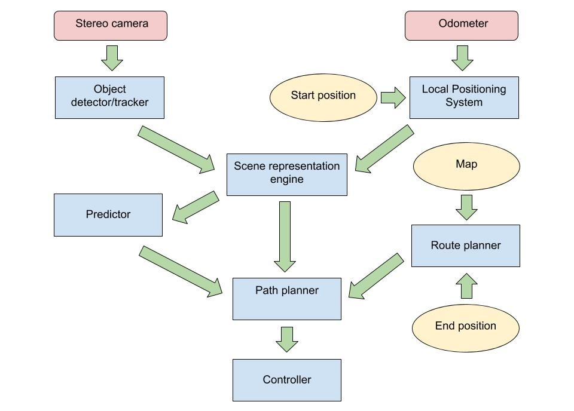
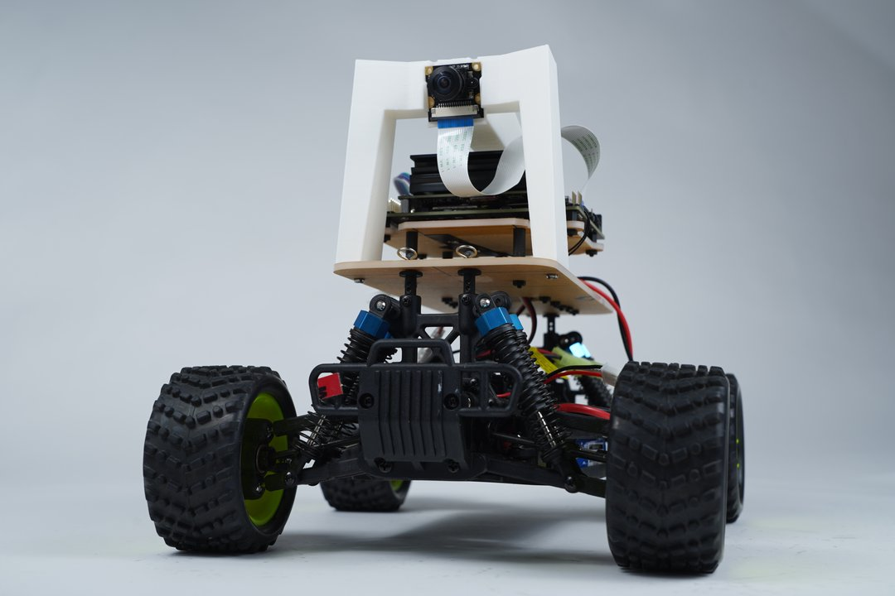

# TNEX (Autonomous Toy Car) [WIP]
TNEX is an AI agent that can drive a toy car. It employs similar techniques used in real state-of-the-art self-driving cars, howbeit with much simpler algorithms and hardware components. The goal is to build a fun robot that can successfully traverse a road network to get from one point to another, and to learn how real driverless cars work by having a feel for what it takes to build one.

## Software
- __Vehicle:__ Code that runs on the toy car for sensing, processing and actuation.
- __Command Center:__ Web UI and server for inspecting telemetry and sending commands to the vehicle.

### Vehicle Components

## Hardware
The Donkeycar Platform

_Source: robocarstore.com_
