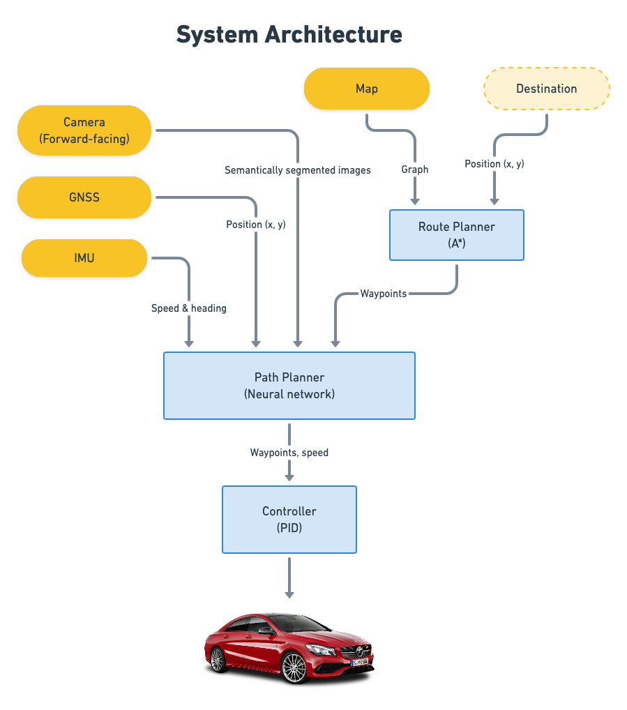

# TNEX
TNEX is a Python program that can drive a vehicle in the [CARLA simulator](https://carla.org). It employs similar techniques used in state-of-the-art self-driving cars, howbeit with simpler algorithms. The goal of this project is to learn how autonomous vehicles work by building one.

## Features
### Cruise Control
TNEX controls the motion of the ego vehicle along its longitudinal axis (i.e gas and brakes) using [PID](https://en.wikipedia.org/wiki/PID_controller) while lateral control (steering) is done manually.


See [demo video](https://youtu.be/OB__1m2O1ew) and [ROS bag](https://tnex-self-driving-car.s3.amazonaws.com/tnex_cruise_control_demo.bag) (2.7GB) for more info.

### Lane Keep Assist
[WIP]

### Point-to-point Navigation
[WIP]

## Architecture


[comment]: # (Add diagrams for ROS and planner network architectures)

## Setup
> Tested with Python 3.7 and Carla 0.9.11
### CARLA
- Install CARLA https://carla.readthedocs.io/en/latest/start_quickstart/#a-debian-carla-installation

- Run CARLA
```sh
cd /opt/carla-simulator
./CarlaUE4.sh -opengl -fps=30
```

### ROS
- Install ROS Noetic http://wiki.ros.org/noetic/Installation/Ubuntu

- Build TNEX
```sh
source /opt/ros/noetic/setup.bash
cd path/to/tnex
catkin_make
```

- Change workspace
```sh
source ./devel/setup.bash # you may save this in your ~/.bashrc
```

- Install dependencies
```sh
sudo apt install \
    ros-noetic-rosbridge-suite \
    ros-noetic-cv-bridge \
    ros-noetic-ros-numpy \
    python3.7-tk # or python3-tk
mkvirtualenv -p python3.7 tnex # optional (PS: have virtualenv wrapper installed)
pip install -r requirements.txt
```

- Run TNEX
```
roslaunch tnex_driver main.launch
```

> While running TNEX, you can record all the ROS topics with `rosbag record -o data/rosbags/tnex -a`.

### Webviz (optional)
- Pull Docker image
```sh
docker pull cruise/webviz
```

- Run Webviz
```sh
docker run --name tnex-webviz -p 8080:8080 cruise/webviz
```

> You can make use of [this layout config](data/webviz_layout.json).


