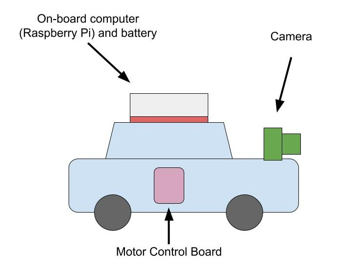

# Autonomous Toy Car (ATC) [WIP]
ATC is an agent that can drive a toy car. It employs the same techniques used in real state-of-the-art self-driving cars to do so howbeit with much simpler algorithms and hardware components. The goal is to build a fun robot that can successfully traverse a road network to get from one point to the other (while obeying traffic rules and interacting with other road users) and to learn how real driverless cars work by having a feel of what it takes to build one.

## Vehicle Hardware
